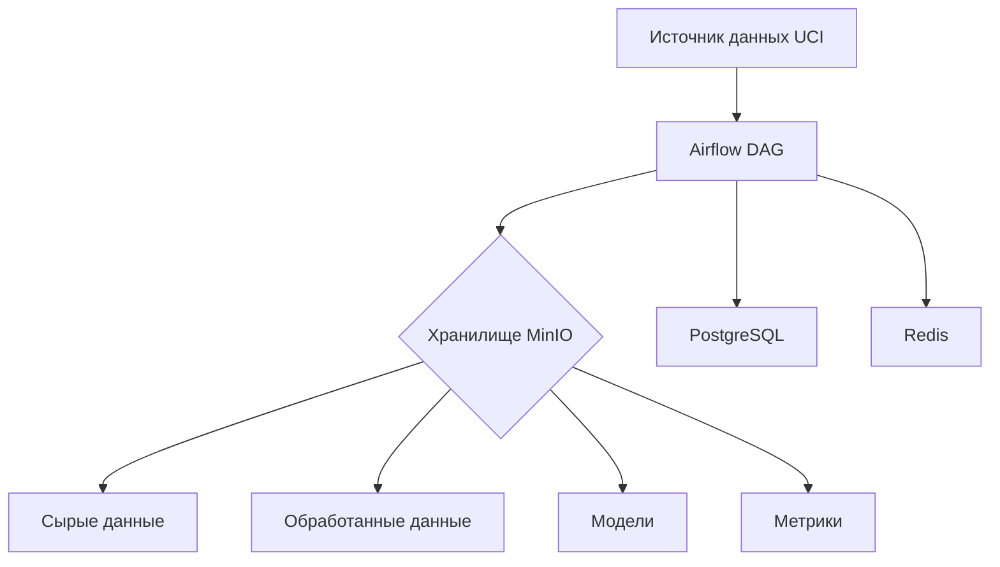
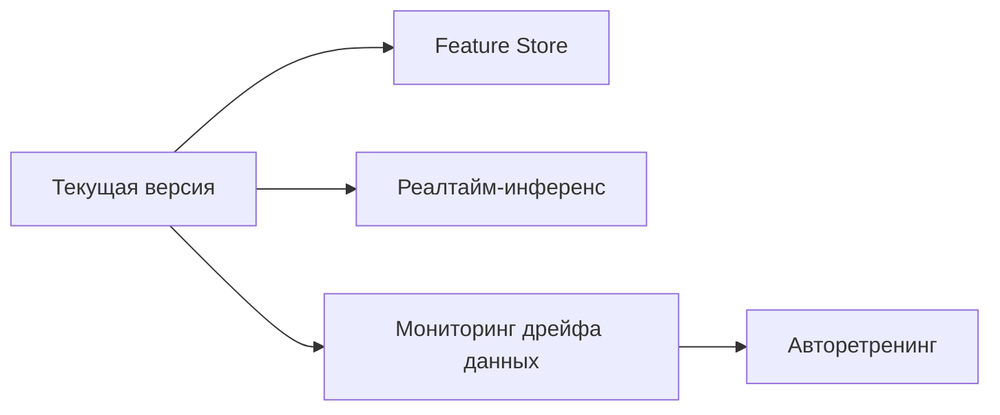

```markdown
# 🚀 Автоматизированный ML-пайплайн для диагностики рака груди с Airflow и MinIO

## 📌 Обзор проекта
**Автоматизированный ETL-пайплайн** для прогнозирования диагноза рака молочной железы с использованием:
- **Apache Airflow 2.7.1** для оркестрации
- **MinIO** как S3-совместимого хранилища
- **Логистической регрессии** (scikit-learn 1.3.0)
- **Датасета Breast Cancer Wisconsin** из UCI ML репозитория


## 🧠 Постановка ML-задачи
**Бинарная классификация** опухолей на злокачественные/доброкачественные по 30 признакам ядер клеток

## 🏗️ Архитектура системы
### Диаграмма компонентов


### Структура DAG


## 🛠️ Структура проекта
```
ml-pipeline/
├── dags/
│   └── ml_pipeline_dag.py
├── etl/
│   ├── download_data.py
│   ├── preprocess_data.py
│   ├── train_model.py
│   └── evaluate_model.py
├── results/
├── logs/
├── scripts/
│   └── setup_minio.sh
├── config/
│   └── config.yaml
├── .env.example
├── requirements.txt
├── Dockerfile
├── docker-compose.yaml
└── README.md
```

## 🚀 Быстрый старт
### 1. Предварительные требования
```bash
docker-compose v2.20+
docker 24.0+
```

### 2. Развертывание
```bash
# Клонировать репозиторий
git clone https://github.com/ваш-репозиторий/ml-pipeline.git
cd ml-pipeline

# Запустить сервисы
docker-compose up -d --build

# Инициализация (подождите 2 минуты)
open http://localhost:8080  # Airflow (логин: admin/admin)
open http://localhost:9001  # MinIO (логин: minioadmin/minioadmin)
```

### 3. Запуск пайплайна
```bash
# Ручной запуск DAG
curl -X POST "http://localhost:8080/api/v1/dags/breast_cancer_pipeline/dagRuns" \
  -H "Content-Type: application/json" \
  -d '{"conf": {}}'
```

## 🔍 Где найти результаты
| Местоположение | Путь | Способ доступа |
|----------------|------|----------------|
| **MinIO** | `ml-pipeline/results/` | Веб-интерфейс или `mc ls local/ml-pipeline` |
| **Локальная ФС** | `./results/` | Прямой доступ к файлам |
| **Airflow** | Логи задач | Веб-интерфейс → DAG Runs → Task Instance |

## 🛡️ Анализ отказов и устойчивость
### Критические точки отказа
| Компонент | Тип отказа | Стратегия обработки |
|-----------|------------|---------------------|
| Источник данных | API недоступен | Повторные попытки (3 раза) |
| MinIO | Бакет отсутствует | Автосоздание в init-скрипте |
| Обучение модели | Не сходится | Ранняя остановка + алерты |
| Airflow | Потеря соединения с БД | Health checks + ретраи |

### Механизмы устойчивости
- ✅ Автоматические повторы для всех задач
- ✅ Изолированные шаги обработки
- ✅ Дублирование хранения (MinIO + локально)
- ✅ Health checks для всех сервисов
- ✅ Подробное логирование

## 💡 Идеи для улучшения
### Ближайшие планы
1. Добавить валидацию данных с Great Expectations
2. Реализовать версионирование моделей через MLflow
3. Настроить автоматические тесты (pytest)

### Перспективные


## 📊 Пример результатов
**metrics.json**
```json
{
  "run_id": "2025-06-17T12:00:00",
  "metrics": {
    "accuracy": 0.956,
    "precision": 0.963,
    "recall": 0.934,
    "f1": 0.948,
    "roc_auc": 0.982
  },
  "artфакты": {
    "модель": "s3://ml-pipeline/models/logreg_v1.joblib",
    "матрица_ошибок": "s3://ml-pipeline/results/plots/cm.png"
  }
}
```

## 🖼️ Скриншоты системы

*Выполнение пайплайна в интерфейсе Airflow*


*Артефакты в MinIO хранилище*

## 📚 Документация
- [Официальная документация Airflow](https://airflow.apache.org/docs/)
- [MinIO Python SDK](https://min.io/docs/minio/linux/developers/python/API.html)
- [Описание датасета](https://archive.ics.uci.edu/ml/datasets/Breast+Cancer+Wisconsin+%28Diagnostic%29)

---

**✨ Профессиональный совет:** Используйте `make monitor` для мониторинга логов:
```bash
docker-compose logs -f airflow-webserver airflow-scheduler minio
```